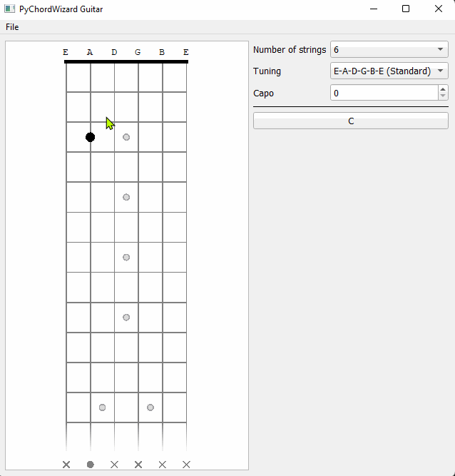

# PyChordWizard
Chord guesser written in Python 3.


## Guitar fretboard


This setup was partly inspired from the oolimo guitar chord analyzer.

## Installing and running

Run the following:
```
python -m venv venv
pip install -r requirements.txt
python pychordwizard_guitar.py
```

You can run the test cases with pytest. On the main folder, simply run:
```
pip install pytest
pytest
```

## TODO
- Implement piano keyboard interface with MIDI listen
- PRS inlay option for the fretboard